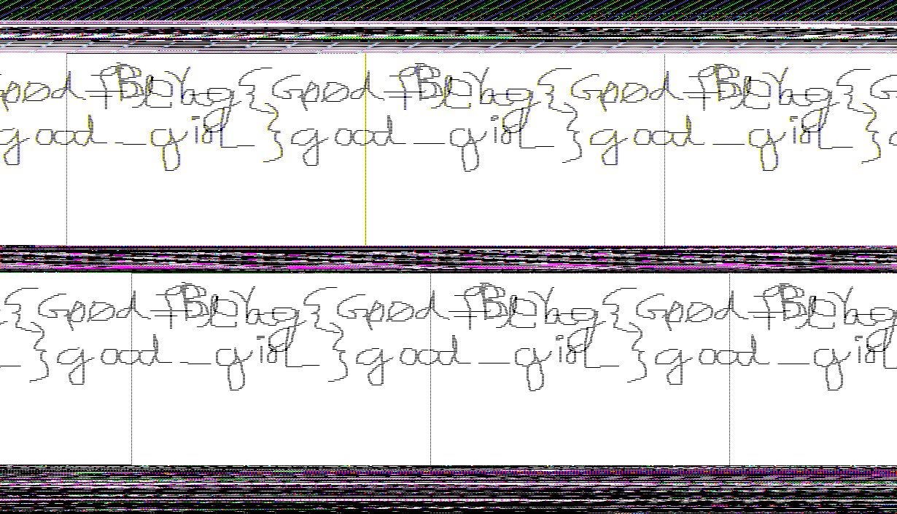

# **MemLabs Lab 1 - Beginner's Luck**

## **Challenge description**

My sister's computer crashed. We were very fortunate to recover this memory dump. Your job is get all her important files from the system. From what we remember, we suddenly saw a black window pop up with some thing being executed. When the crash happened, she was trying to draw something. Thats all we remember from the time of crash.

**Note**: This challenge is composed of 3 flags.

**Challenge file**: [MemLabs_Lab1](https://mega.nz/#!6l4BhKIb!l8ATZoliB_ULlvlkESwkPiXAETJEF7p91Gf9CWuQI70)

# **Solution**

## Primary analysis

Let's do some primary analysis. We'll be using volatility for analysis and recovery.

We can use ```imageinfo``` to get some basic info of the memory dump,


We'll be choosing the first suggested profile: ```Win7SP1x64```

From the chall description, we can infer that we have to look into these three main points:

 - what "black window pop up" was
 - what she was trying to draw
 - the important files in her system

Let's go through them one by one...

## **Part 1**

So the description said that there was a black window pop up, which probably will be a command prompt window.

We can list out all the processes running the dump using ```pslist```

```bash
vol.py -f MemoryDump_Lab1.raw --profile=Win7SP1x64 pslist
```


We can see that cmd.exe was running at the time of the dump. We can use ```consoles``` command in volatility to extract the command history.

```bash
└>( ._.) vol.py -f MemoryDump_Lab1.raw --profile=Win7SP1x64 consoles                                         
Volatility Foundation Volatility Framework 2.6.1
**************************************************
ConsoleProcess: conhost.exe Pid: 2692
Console: 0xff756200 CommandHistorySize: 50
HistoryBufferCount: 1 HistoryBufferMax: 4
OriginalTitle: %SystemRoot%\system32\cmd.exe
Title: C:\Windows\system32\cmd.exe - St4G3$1
AttachedProcess: cmd.exe Pid: 1984 Handle: 0x60
----
CommandHistory: 0x1fe9c0 Application: cmd.exe Flags: Allocated, Reset
CommandCount: 1 LastAdded: 0 LastDisplayed: 0
FirstCommand: 0 CommandCountMax: 50
ProcessHandle: 0x60
Cmd #0 at 0x1de3c0: St4G3$1
----
Screen 0x1e0f70 X:80 Y:300
Dump:
Microsoft Windows [Version 6.1.7601]                                            
Copyright (c) 2009 Microsoft Corporation.  All rights reserved.                 
                                                                                
C:\Users\SmartNet>St4G3$1                                                       
ZmxhZ3t0aDFzXzFzX3RoM18xc3Rfc3Q0ZzMhIX0=                                        
Press any key to continue . . .                                                 
**************************************************
ConsoleProcess: conhost.exe Pid: 2260
Console: 0xff756200 CommandHistorySize: 50
HistoryBufferCount: 1 HistoryBufferMax: 4
OriginalTitle: C:\Users\SmartNet\Downloads\DumpIt\DumpIt.exe
Title: C:\Users\SmartNet\Downloads\DumpIt\DumpIt.exe
AttachedProcess: DumpIt.exe Pid: 796 Handle: 0x60
----
CommandHistory: 0x38ea90 Application: DumpIt.exe Flags: Allocated
CommandCount: 0 LastAdded: -1 LastDisplayed: -1
FirstCommand: 0 CommandCountMax: 50
ProcessHandle: 0x60
----
Screen 0x371050 X:80 Y:300
Dump:
  DumpIt - v1.3.2.20110401 - One click memory memory dumper                     
  Copyright (c) 2007 - 2011, Matthieu Suiche <http://www.msuiche.net>           
  Copyright (c) 2010 - 2011, MoonSols <http://www.moonsols.com>                 
                                                                                
                                                                                
    Address space size:        1073676288 bytes (   1023 Mb)                    
    Free space size:          24185389056 bytes (  23064 Mb)                    
                                                                                
    * Destination = \??\C:\Users\SmartNet\Downloads\DumpIt\SMARTNET-PC-20191211-
143755.raw                                                                      
                                                                                
    --> Are you sure you want to continue? [y/n] y                              
    + Processing...
```

And we have a b64 encoded string, ```ZmxhZ3t0aDFzXzFzX3RoM18xc3Rfc3Q0ZzMhIX0=``` decoding it gives us the first flag,


```flag{th1s_1s_th3_1st_st4g3!!}```

<hr>

## **Part 2**

Now we have to figure out what she was trying to draw. In the previous section, we can also see ```mspaint.exe``` in the pslist. Let's try dumping the process.


Here's something about MSPaint..

MS Paint stores its content in the RAM in a bitmap. A bitmap is a rectangular grid of pixels, each of which has a color value. The color values are stored in a contiguous block of memory, and the width and height of the bitmap are stored in separate variables.

The size of the bitmap in memory is determined by the width and height of the image and the number of bits per pixel. For example, a 100x100 image with 24 bits per pixel will take up 240,000 bytes of memory.

Some other programs which uses bitmaps to store data in memory are:

  - Adobe Photoshop
  - GIMP
  - Paint.NET
  - Inkscape
  - Microsoft Photo Editor
  - Windows Photo Viewer

This means that we can recover the drawing straight from the memory dump of mspaint.exe. We can use GIMP to open up the dump as raw image data.

Change the extension from .dmp to .data.


Playin around with the width, height and the offset, we get this...


We can just mirror the image vertically and we get the flag...



```flag{G00d_BoY_good_girL}```

<hr>

## **Part 3**

The third part we have to look into is recovering the important files.

Doing a filescan gives us a lot of files,


Let's try grepping for "important",


Looks like we got a hit! Let's try dumping the file...


Trying to unrar the file gives us a password prompt,


Looks like we'll have to dump the hashes to get the password of Alissa's account.

We can use ```hashdump``` for this,


And we get the hash for alissa's password,

```f4ff64c8baac57d22f22edc681055ba6```

Converting it to uppercase,

```F4FF64C8BAAC57D22F22EDC681055BA6```


And there we go, the final flag!

