# **MemLabs Lab 2 - A New World**

## **Challenge description**

One of the clients of our company, lost the access to his system due to an unknown error. He is supposedly a very popular "environmental" activist. As a part of the investigation, he told us that his go to applications are browsers, his password managers etc. We hope that you can dig into this memory dump and find his important stuff and give it back to us.

**Note**: This challenge is composed of 3 flags.

**Challenge file**: [MemLabs_Lab2](https://mega.nz/#!ChoDHaja!1XvuQd49c7-7kgJvPXIEAst-NXi8L3ggwienE1uoZTk)

<br>

# **Solution**

## Primary Analysis

Using ```imageinfo``` to get basic info about the dump,

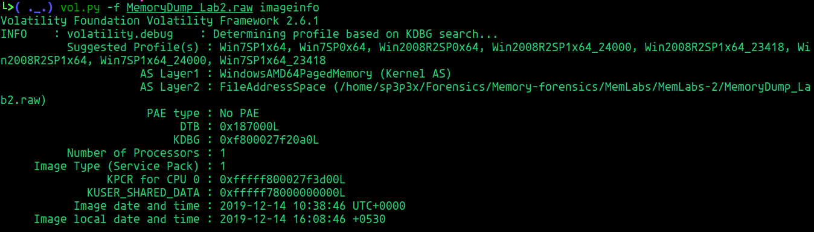

From the challenge description, we can understand that we have to look into three main points:

  - The fact that "environmental" is being emphasized might mean that we'll have to look into the environmental variables.
  - Password manager
  - Web browser

Let's go through them one by one...

## **Part 1**

The fact that the description is emphasizing on the word environment is kind of a direct clue that we'll have to checkout the environment variables.

We can do that in volatility using ```envars```

```bash
vol.py -f MemoryDump_Lab2.raw --profile=Win7SP1x64 envars
```

We can find a env variable with seemingly a b64 encoded text in the value (path)

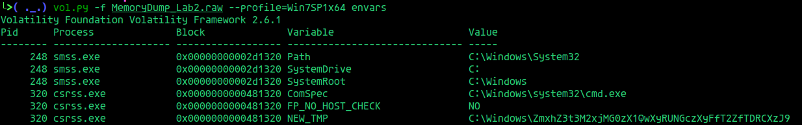

```
C:\Windows\ZmxhZ3t3M2xjMG0zX1QwXyRUNGczXyFfT2ZfTDRCXzJ9
```

b64 decoding it gives our first flag,

```flag{w3lc0m3_T0_$T4g3_!_Of_L4B_2}```

<hr>

## **Part 2**

It is mentioned in the description that password manager was one the client's go to applications.

Doing a ```pslist``` show us that KeepPass was running...

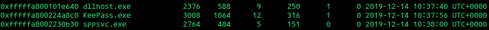

From here we can either dump the KeepPass process and go through the strings or just do a ```filescan``` for ```.kdbx``` files since that is the file format of the database KeepPass uses to store the passwords in.

Doing a filescan and grepping for .kdbx files gives us this,

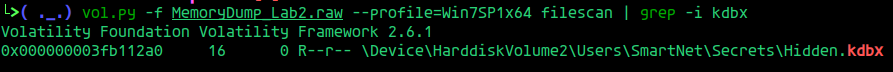

Now that we have the password db, let's try dumping and going through the contents..

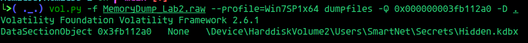

Opening it up in KeepPass application, it prompts us for a master password...

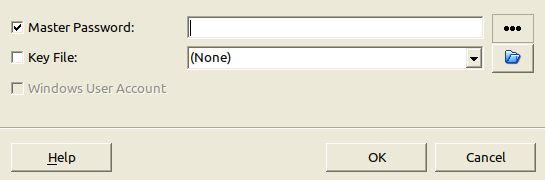

Let's try doing a filescan and grep for "password"...

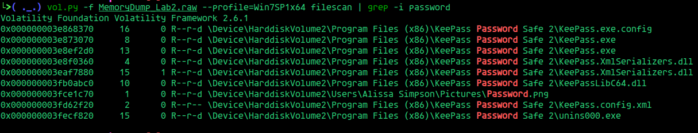

And there we go.. we have a ```Password.png``` in the Pictures folder.

Let's try dumping the png,

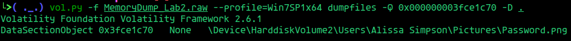

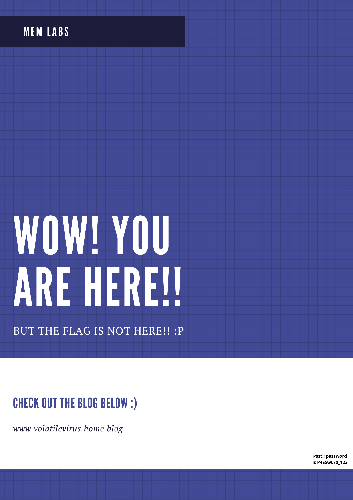

Password: ```P4SSw0rd_123```

Now that we got the master password to the KeepPass db, let's open it up in KeepPass and take a look inside..

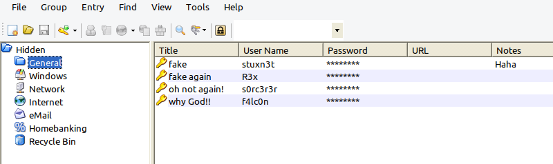

None of the entried in General contains the flag..
After looking around, I found the flag in the "Recycle bin" tab..

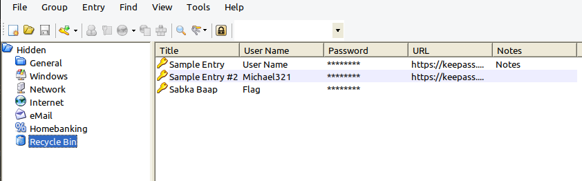

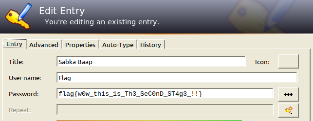

And there we have it! The second flag...

```flag{w0w_th1s_1s_Th3_SeC0nD_ST4g3_!!}```

<hr>

## **Part 3**

The other go to application of the client was the web browser.. Doing a pslist shows that chrome.exe had been running..

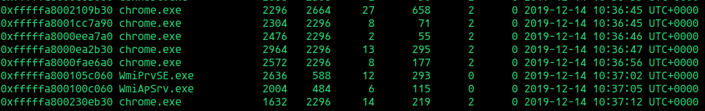

We can use a volatility plugin to parse and extract information of Chrome. I'll be using the chrome plugin i found [here](https://github.com/superponible/volatility-plugins) to do this.

Checking the chrome history gives us this,

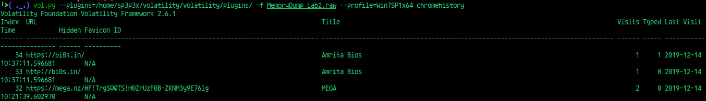

And in the third entry, he goes to [this mega site](https://mega.nz/#F!TrgSQQTS!H0ZrUzF0B-ZKNM3y9E76lg)

Opening up the link gives us the mega link to an "Important.zip" file.

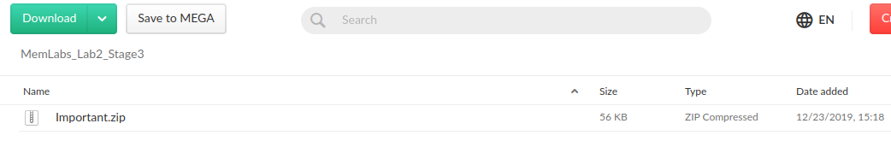

Let's download it and try unzipping,

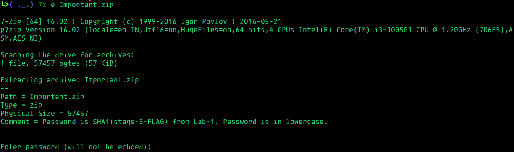

It needs a password and it seems like its just the SHA1 of the stage-3 flag of Lab-1 in lowercase.

Stage-3 flag [Lab-1]       : flag{w3ll_3rd_stage_was_easy}

SHA1(Stage-3 flag [Lab-1]) : 6045dd90029719a039fd2d2ebcca718439dd100a

Unzipping it using the password gives us the flag..


```flag{oK_So_Now_St4g3_3_is_DoNE!!}```